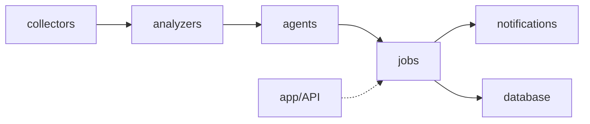

# Arquitetura — Pipeline

## Visão geral

O sistema segue um pipeline modular:

```
collectors → analyzers → agents → jobs → notifications
                                    ↘ database
app/API (futuro: web, admin, chat)
```



## Estrutura de pastas

```
radar-financeiro-ia/
├── docs/                          # Especificações e prompts (fonte da verdade)
├── .cursor/
│   ├── rules/                     # Convenções persistentes do agente
│   └── skills/                    # Workflows recorrentes (fase 2+)
├── app/                           # API FastAPI
│   ├── api/routes/
│   ├── config.py
│   └── main.py
├── collectors/                    # Coleta de dados de mercado
├── analyzers/                     # Processamento e regras
├── agents/                        # Resumos e interpretação com IA
├── notifications/                 # Telegram / WhatsApp
├── jobs/                          # Orquestração dos fluxos
└── database/                      # Models e conexão
```

## Responsabilidade de cada camada

| Camada | Responsabilidade | Exemplos |
|---|---|---|
| `collectors/` | Buscar dados externos | cotações, dividendos, fatos relevantes |
| `analyzers/` | Aplicar regras e detectar destaques | variação de preço, eventos corporativos |
| `agents/` | Gerar texto com IA | resumo diário, interpretação de eventos |
| `jobs/` | Orquestrar o fluxo completo | `DailyRadarJob`, agendamento |
| `notifications/` | Entregar mensagens | Telegram, WhatsApp |
| `database/` | Persistir histórico | snapshots, alertas, mensagens enviadas |
| `app/` | Expor API REST | health, trigger de jobs, histórico, chat |

## Fluxo do MVP 1 (atual)

1. `DailyRadarJob` resolve tickers (usuário ou config)
2. `StocksCollector` + `FiiCollector` buscam cotações (brapi.dev)
3. `PriceAnalyzer` gera destaques de preço
4. `SummaryAgent` gera resumo via OpenAI
5. Mensagem formatada e enviada via `TelegramSender`
6. Dados persistidos em `MarketSnapshot`, `Alert`, `MessageSent`

## Modelo de dados (visão atual)

| Tabela | Uso |
|---|---|
| `users` | Usuários e `telegram_chat_id` |
| `assets` | Ativos monitorados (stock, fii) |
| `user_assets` | Carteira por usuário (MVP 4) |
| `market_snapshots` | Histórico de cotações |
| `alerts` | Alertas gerados (preço, resumo, eventos) |
| `messages_sent` | Mensagens enviadas por canal |

## Extensões planejadas por MVP

| MVP | Novos módulos |
|---|---|
| MVP 1 | `jobs/scheduler.py`, rotas `/radar`, `/alerts` |
| MVP 2 | `collectors/dividends_collector.py`, `collectors/events_collector.py` |
| MVP 3 | `agents/interpretation_agent.py` |
| MVP 4 | `app/api/routes/users.py`, `portfolio.py` |
| MVP 5 | `agents/chat_agent.py`, `app/api/routes/chat.py` |

## Princípios

1. **Collectors não analisam** — só buscam e normalizam dados
2. **Analyzers não chamam IA** — só aplicam regras determinísticas
3. **Agents não coletam dados** — só geram texto a partir de inputs estruturados
4. **Jobs orquestram** — são o ponto de entrada dos fluxos batch
5. **IA nunca recomenda compra ou venda** — tom informativo e neutro
