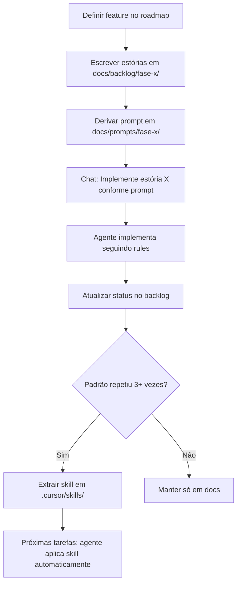

# Plano de Implementação — Radar Financeiro IA

> Documento mestre do projeto. Cobre da Fase 0 até o MVP 5, incluindo estratégia de documentação, skills e rules.

## Validação da estrutura atual

A estrutura do repositório está **coerente** com a visão do produto. O desenho modular (`collectors → analyzers → agents → jobs → notifications`) escala naturalmente sem refatoração grande.

### Mapeamento visão × código

| Conceito do produto | Status |
|---|---|
| Monitoramento ações + FIIs (Fase 1) | Implementado |
| Radar diário com resumo IA | Implementado |
| Entrega via Telegram | Implementado |
| Histórico de alertas | Modelos prontos |
| Não recomendar compra/venda | Prompt do `SummaryAgent` |
| Personalização por carteira (MVP 4) | Base pronta (`User`, `UserAsset`) |
| Eventos relevantes (MVP 2) | Placeholder (`EventAnalyzer`) |
| WhatsApp | Placeholder |
| Web / API completa | Apenas health check |
| Assistente conversacional (MVP 5) | Não iniciado |

### Lacunas do MVP 1 (prioridade imediata)

1. `PriceAnalyzer` usa só variação **do dia** — roadmap pede semana/mês
2. `StocksCollector` não popula `change_percent_week` / `change_percent_month`
3. Sem lógica de FII abaixo do valor patrimonial
4. `apscheduler` no `requirements.txt`, mas sem agendamento configurado
5. API sem endpoints de histórico e trigger manual
6. Sem `__init__.py`, migrations (Alembic) nem testes

---

## Estratégia: Docs vs Skills vs Rules

### Três camadas, papéis diferentes

| Camada | Onde | Para quê | Quando usar |
|---|---|---|---|
| **Docs** | `docs/` | Visão, roadmap, specs, prompts | Fonte da verdade do produto |
| **Skills** | `.cursor/skills/` | Workflows auto-aplicáveis pelo agente | Tarefas repetíveis com padrão estável |
| **Rules** | `.cursor/rules/` | Convenções persistentes | Padrões em toda sessão ou por pasta |

### `docs/` — especificações

Três subcamadas:

| Subpasta | Conteúdo |
|---|---|
| `docs/backlog/fase-x/` | Estórias com critérios de aceite (o quê e por quê) |
| `docs/prompts/fase-x/` | Prompts derivados das estórias (como implementar) |
| `docs/product/`, `architecture/` | Visão, roadmap, arquitetura |

**Uso no chat:**

> Implemente a estória MVP1-01 conforme `docs/prompts/fase-1/01-coletar-variacoes.md`

### `.cursor/skills/` — workflows recorrentes

Skills são carregadas **automaticamente** pelo agente quando o `description` no frontmatter combina com a tarefa.

**Candidatas (criar após padrão se repetir 3+ vezes):**

| Skill | Trigger |
|---|---|
| `implement-collector` | Criar/alterar `collectors/` |
| `implement-analyzer` | Criar regras em `analyzers/` |
| `financial-ai-prompts` | Escrever prompts de IA |
| `add-alert-type` | Novos tipos de alerta (MVP 2+) |
| `daily-radar-job` | Alterar fluxo do job diário |

**Regra:** não duplicar conteúdo. Skill enxuta aponta para `docs/` para detalhes.

### `.cursor/rules/` — convenções

| Rule | Escopo |
|---|---|
| `financial-disclaimer` | Sempre ativa — tom neutro, sem recomendação |
| `architecture-pipeline` | Sempre ativa — respeitar camadas do pipeline |

### Fluxo de trabalho



---

## Fases de implementação

### Fase 0 — Fundação

**Objetivo:** base documentada e convenções definidas.

| # | Tarefa | Entregável |
|---|---|---|
| 0.1 | Criar `docs/product/` | `visao-geral.md`, `roadmap.md` |
| 0.2 | Documentar arquitetura | `architecture/pipeline.md` |
| 0.3 | Criar rules | `.cursor/rules/` |
| 0.4 | Adicionar `__init__.py` nos pacotes | imports estáveis |
| 0.5 | Configurar Alembic | `alembic/` + primeira migration |

**Backlog:** [`backlog/fase-0/fase-0-fundacao.md`](backlog/fase-0/fase-0-fundacao.md)

**Status:** 0.1–0.5 concluídos.

---

### Fase 1 — Completar MVP 1 (3–5 dias)

**Objetivo:** radar diário funcional de ponta a ponta.

| # | Tarefa | Módulo | Prioridade |
|---|---|---|---|
| 1.1 | Coletar variação semanal e mensal | `collectors/` | Alta |
| 1.2 | Destaques por semana/mês | `analyzers/price_analyzer.py` | Alta |
| 1.3 | Regra FII abaixo do VP | `analyzers/` | Média |
| 1.4 | Agendamento diário (APScheduler) | `jobs/scheduler.py` | Alta |
| 1.5 | `POST /radar/run` | `app/api/routes/` | Média |
| 1.6 | `GET /alerts` | `app/api/routes/` | Média |
| 1.7 | Testes do fluxo principal | `tests/` | Média |

**Critério de aceite:**

```
Radar Financeiro - 14/06/2026

• PETR4 caiu 3,2% na semana.
• VALE3 subiu 4,1% no mês.
• HGLG11 negocia abaixo do valor patrimonial.

Resumo IA:
O mercado apresenta sinais mistos...
```

**Backlog:** [`backlog/fase-1/fase-1-mvp1.md`](backlog/fase-1/fase-1-mvp1.md)
**Prompts:** [`prompts/fase-1/README.md`](prompts/fase-1/README.md)

---

### Fase 2 — MVP 2: Eventos Relevantes (1–2 semanas)

**Objetivo:** alertas além de preço.

| # | Tarefa | Módulo |
|---|---|---|
| 2.1 | Collector de dividendos e JCP | `collectors/dividends_collector.py` |
| 2.2 | Collector de fatos relevantes | `collectors/events_collector.py` |
| 2.3 | Implementar `EventAnalyzer` | `analyzers/event_analyzer.py` |
| 2.4 | Novos `alert_type` | `database/models.py` |
| 2.5 | Job de eventos | `jobs/events_job.py` |
| 2.6 | Formato de alerta com datas | `notifications/` |

**Prompt:** [`prompts/fase-2/README.md`](prompts/fase-2/README.md) — ver prompts numerados 01–07

**Backlog:** [`backlog/fase-2/fase-2-mvp2.md`](backlog/fase-2/fase-2-mvp2.md)

**Skills candidatas:** `implement-collector`, `add-alert-type`

---

### Fase 3 — MVP 3: Inteligência Financeira (1 semana)

**Objetivo:** interpretação contextual.

| # | Tarefa | Módulo |
|---|---|---|
| 3.1 | `InterpretationAgent` | `agents/interpretation_agent.py` |
| 3.2 | Prompt com contexto histórico | `agents/` |
| 3.3 | Integrar nos alertas de evento | `jobs/` |
| 3.4 | Fallback sem OpenAI | `agents/` |

**Exemplo alvo:**

> PETR4 anunciou dividendos equivalentes a ~8,2% a.a., acima da média dos últimos 3 anos.

**Prompt:** `prompts/mvp3-interpretacao-ia.md` (criar na Fase 3)

**Skill candidata:** `financial-ai-prompts`

---

### Fase 4 — MVP 4: Personalização (1 semana)

**Objetivo:** cada usuário com sua carteira.

| # | Tarefa | Módulo |
|---|---|---|
| 4.1 | CRUD de usuários | `app/api/routes/users.py` |
| 4.2 | CRUD de carteira | `app/api/routes/portfolio.py` |
| 4.3 | Radar filtrado por usuário | `jobs/daily_radar_job.py` |
| 4.4 | Preferências de alerta | `database/models.py` |

**Prompt:** `prompts/mvp4-personalizacao.md` (criar na Fase 4)

---

### Fase 5 — MVP 5: Assistente Conversacional (2+ semanas)

**Objetivo:** interação direta com IA.

| # | Tarefa | Módulo |
|---|---|---|
| 5.1 | `ChatAgent` | `agents/chat_agent.py` |
| 5.2 | `POST /chat` | `app/api/routes/chat.py` |
| 5.3 | Comandos no Telegram | `notifications/` |
| 5.4 | RAG sobre histórico | `agents/` + `database/` |

**Prompt:** `prompts/mvp5-assistente-conversacional.md` (criar na Fase 5)

---

## Avaliação por MVP

| MVP | Estrutura preparada | Implementado |
|---|---|---|
| MVP 1 — Radar Diário | Sim | ~70% |
| MVP 2 — Eventos | Parcial | Não |
| MVP 3 — Inteligência | Parcial | Parcial |
| MVP 4 — Personalização | Sim | Parcial |
| MVP 5 — Conversacional | Não | Não |

---

## Próximo passo

Implementar **Fase 1** começando pela estória MVP1-01: [`prompts/fase-1/01-coletar-variacoes.md`](prompts/fase-1/01-coletar-variacoes.md).
